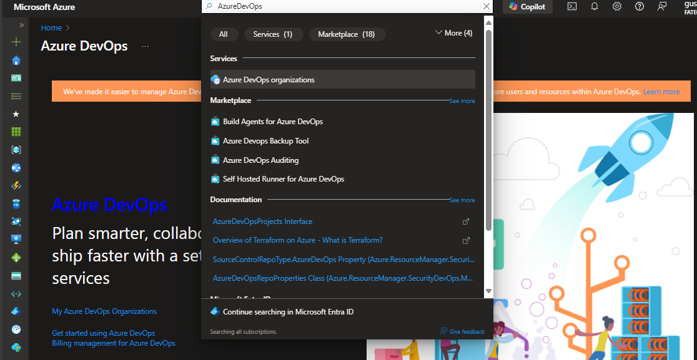
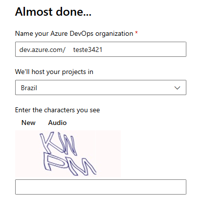
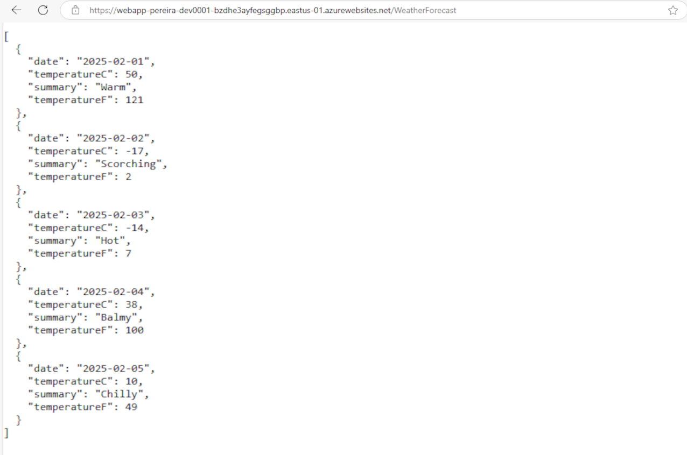
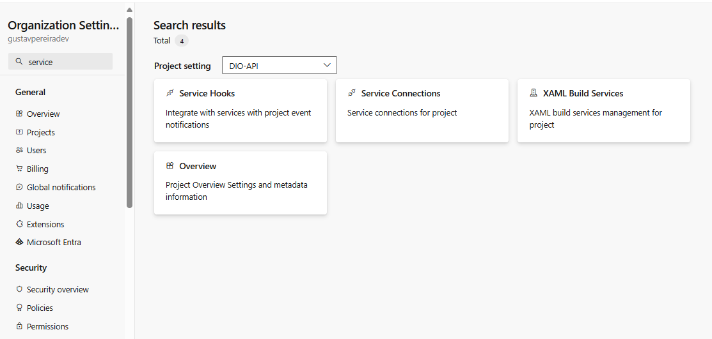
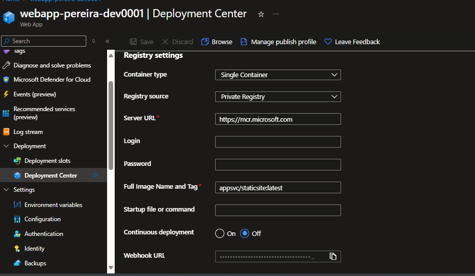
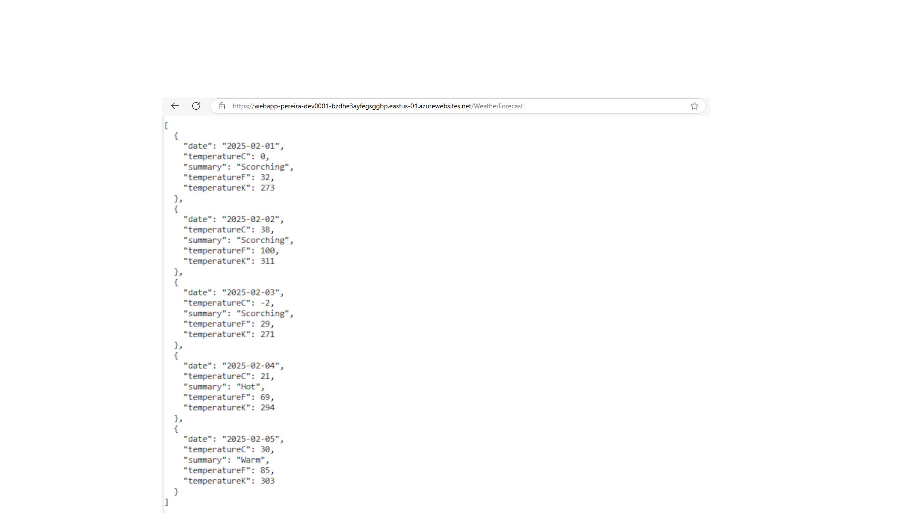

# Como Fazer o Deploy de uma API na Nuvem na Prática

Esse diretório conta com o desenvolvimento e passo a passo de como hospedar uma API do .NET (C#) com Container (Docker) para a Nuvem do Azure

É um processo que leva tempo e tem bastante tópicos específicos, então terá algumas divisões por cabeçalho

Glossário aqui

## Criando o Repositório 

Antes de tudo, tenho que salientar que local de gerenciamento e uso de Workflows que foi usado para isso não foi o Github daqui exatamente, mas sim o "Azure DevOps" (plataforma da Microsoft que oferece um conjunto de recursos e serviços para otimizar o ciclo de desenvolvimento e aplicação de software com enfoque em especial no próprio Azure). Ainda assim é possível utilizar o Github para isso caso já tenha conhecimento prévio em especial na parte dos Workflows, mas que pode diferir de algumas coisas em relação as feitas aqui pelo DevOps

Inicialmente para acessá-lo, você entrar no Portal do Azure e pesquisar "Azure DevOps" para entrar na conta e se cadastrar nela

Após toda a parte de criação da conta e da organização (exemplo abaixo da criação de organização) você pode fazer o projeto (ou repositório)

Clique em "new project" e siga os passos a passos

Criando o projeto, você tem acesso ao link desse repositório para desenvolver em sua IDE preferida. Recomendo o uso do Visual Studio mas, aqui diferente da parte do Github Workflow, tem o passo a passo para ambas as opções

### Utilizando o Visual Studio

Pelo Visual Studio ter mais integração com a linguagem C# e seu Framework .NET, o processo de criação e também desenvolvimento é bem mais simples e prático que no VSCode, aqui está a criação (a lib especial utiliza é a "ASP.NET Core Web API"). Lembre de passar o diretório que está o repositório local do projeto no seu computador

### Utilizando o VSCode

No VSCode, clone o projeto/repositório e desenvolva uma WebAPI na pasta root dele

A estrutura de pasta ficará em um formato semelhante a esse: 

Para executar a API e utilizá-la pelo localhost faça os seguintes comandos

### DockerFile

O Dockerfile (que ficará na pasta root do projeto da API, não confundir com a root do repositório) ficará mais ou menos nesse formato:

## Desenvolvendo

Abaixo está exemplos do resultado que será disparado ao no link do localhost

Crie o WeatherForecast.cs na mesma pasta do Program.cs

O resultado será este se você ir para o "/WeatherForecast"

Após todas as adições e alterações, vamos commitar para o projeto do Azure DevOps:

Dessa forma, quando entrar no projeto, a estruturação dos arquivos próximo dessa forma aqui

### Criando recursos

Indo para o Azure (a Cloud), vamos criar respectivamente um grupo de recursos (resource group), Container de Registros (Container Registry) e um Aplicativo Web (Web App)

### Pipeline

Voltando ao Azure DevOps, vamos ao desenvolvimento da parte mais complexa do lab, o desenvolvimento da Pipeline (conjunto de instruções utilizados para se dar Deploy no projeto)

Dentro do projeto (repo) crie uma Pipeline e selecione onde está o código, repositório e a tipo de configuração da Pipeline (Starter Pipeline) e o código inicial de sua Pipeline

Assim, faça a primeira execução do Workflow e verifique se foi tudo concluído com sucesso

Depois, adicione as variáveis que serão utilizas depois e confirme novamente se tudo foi com êxito

#### Service Connection

Crie o serviço de conexão do projeto (configurações/engrenagem > Service Conenctions) do Docker Register pelo Container de Registro criado pela Cloud da Azure

Dentro da edição do Workflow, vá para a parte de Tasks,0 escolher Docker e siga os seguintes passos: 

Nota: o task abaixo deve ser o último de todos

Após executar o Workflow novamente, você verá um Repositório no ACR criado do seu Azure pela Service Connection desenvolvida

#### Webhooks

Vamos criar uma Weebhook no ACR com o Repositorie criado

Antes disso, colete a url de Webhook do Web App

Agora indo para Webhooks do ACR, vamos criar ela

#### Pré configurações do Deployment Center

Antes de ser acessível o Deploy pela parte do Azure, precisamos fazer algumas coisas ainda:

- Ative o modo admin do ACR

Ative o SCM do Web App 

### Deployment Center

Indo para o Centro de implementação, estamos próximo do final desse lab. Vamos implementar o Deploy agora:

Salve essa configuração 

### Trigger

Na última parte, vamos ativar um Trigger para que caso haja alguma alteração no Projeto do DevOps, seja feito a build e o deploy novamente do repositório para o Azure (vá para a edição do Workflow clique nos 3 pontos e vá para trigger)

Selecione essa opção, cilque em "Save & Queue" e depois "Save"

Vamos testar isso. Atualize o Process.cs (primeira imagem abaixo) no final. Possivelmente é algo necessário somente para quem fez no VSCode

Para ambas as IDEs, atualize o WeatherForecast.cs

Agora vamos dar commit e dar push para o Projeto

Indo agora para a execução do Workflow (o Job) é possível ver que o Trigger realmente funcionou e está atualizando tanto o Deploy do Azure DevOps quanto o da Cloud, atualizando o site hospedado também pela mesma

Contudo, como não existe umma opção de latest (dar o Deploy sempre pela última alteração), o site ainda está na versão anterior, devendo assim atualizar a nova versão no Centro de Implementação do Web App

O resultado agora será esse abaixo:

Assim, foi feito o Deploy de uma API na Nuvem do Azure!

