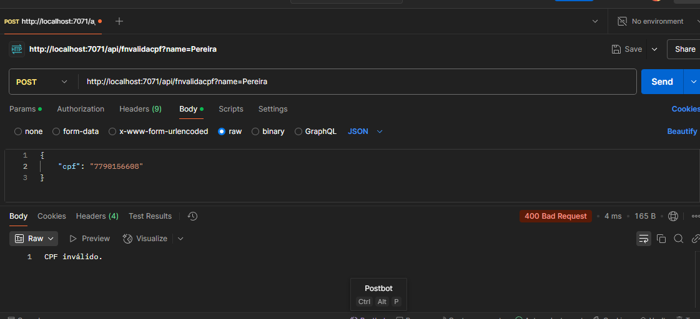

# Criando um Microsserviço Serverless para Validação de CPF

O objeto do projeto é desenvolver, com o Azure Functions, uma funcionalidade de análise de um CPF em específico e retornar (por uma função pré-determinada) se ele é válido ou inválido, como a imagem abaixo demonstra

## Criando a Function App no dispositivo

Inicialmente, vamos criar a function (função) com a extensão "Azure Functions": Ao desenvolvê-la, se pede o nome da function, a versão do C#/.Net que será utilizada e a localidade da function

Após ela ter criada, na pasta que será armazeana a function se faz o seguinte comando com a "func" para desenvolver a estruração do projeto e da function

O resultado no diretório será mais ou menos esse:

Dentro da mesma pasta, faça <code>func new</code> e escolha as respectivas opções: QueueTrigger (normalmente é o número 2) e o nome da function em si

Vamos agora testar a formatação padrão deste arquivo no padrão
Inicie a execução da function (no localhost) pelo <code>func start</code> e colete o link

Para a testagem de execução e retorno dela, usarei o Postman

Usando o HTTP get (sem nenhum parâmetro) é retornado a mensagem abaixo, contudo, se adicionado o nome retorna-se outra

Uma curiosidade é que enquanto sua function está sendo executada, existe uma espécie de log mostrando as ações e retornos feitos, sendo possível usar ela para analisar possíveis erros ou diversidades

Após umas adições e alterações para que a function verifique um CPF, o retorno respectivo de um válido e inválido (de um POST) com o Body tendo "cpf" são esses:

Assim, após ter sido feito a function vamos passar a atualização e publicar no portal do Azure (com um link dessa vez mais "global")

Como se pode ver, as coisas mudaram. Não é possível mais fazer o Post da mesma forma pois por padrão o Azure pede um código de chave agora para poder utilizá-la

Para encontrar essa key entre no Portal do Azure, pesquise Azure Functions e procure a sua função em específica desenvolvida

Após entrar, vá para "App Keys" e copie a chave "default" para utilizamos no Postman

Colando a chave no parâmetro code, a função está agora funcionando de forma normal, sendo possível qualquer um com a key utilizá-la para a validação!

